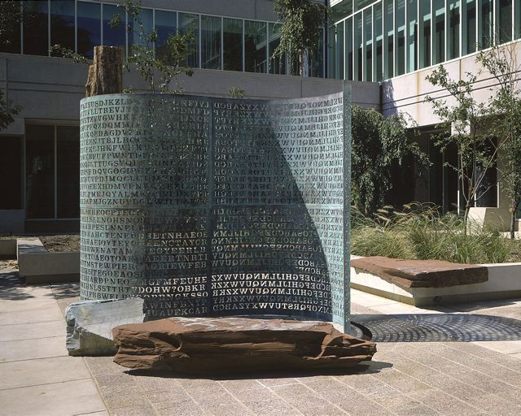

# Kryptos cracking

### Experiments in cryptanalysis to crack the Kryptos sculpture at CIA headquarters

The Kryptos sculpture at CIA headquarters has been a source of intrigue since its installation in 1990. The sculpture contains four encrypted messages, three of which have been solved. The fourth message, known as K4, remains unsolved. This repository contains experiments in cryptanalysis to crack K4.

The as-yet uncracked ciphertext is as follows:

```
OBKRUOXOGHULBSOLIFBBWFLRVQQPRNGKSSOTWTQSJQSSEKZZWATJKLUDIAWINFBNYPVTTMZFPKWGDKZXTJCDIGKUHUAUEKCAR
```

The plaintext of K4 is known to contain the following text:

```
NORTHEAST
```

```
BERLINCLOCK
```
The sculpture was created by artist Jim Sanborn, who has provided clues to help solve the puzzle. 

The first three messages were solved using a variety of techniques, including frequency analysis, transposition ciphers, and the Vigenère cipher. 

The fourth message is believed to be encrypted using a different method, possibly involving a masking methodology as well as other techniques.

The sculpture itself can be seen below:

